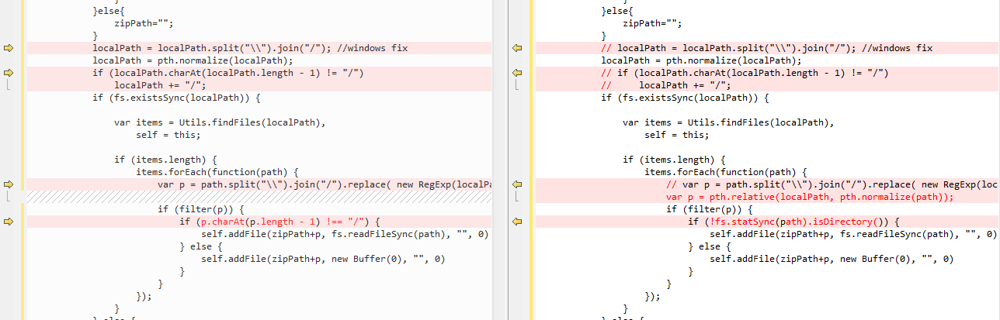

# Athena 组件平台

集合组件上传、组件拉取、和组件预览功能。

## 部署指引

``` bash
# 安装 NodeJS（建议版本>=6.0.0）
# 安装 MongoDB

git clone https://github.com/o2team/athena-component.git

cd athena-component/src
npm install
node install

cd app
npm install

# ----- #

# 前端调试 ./src/app -> http://localhost:8080/#!/list
npm run dev
# 前端编译 ./src/app -> http://localhost:8080/#!/list
npm run build

# 后端开发 ./src -> http://localhost/#!/list
mongod --dbpath ./database
npm run test

# 自定义配置 ac-config.json

# ----- #

# 前后端“双服务器热替换模式”联调指引
# 1. 找到 ./src/app/webpack.config.js，将【单前端调试】部分注释，将【前后端联调】部分取消注释
# 2. 找到 ./src/app/index.html，修改打包文件的地址：dist/bundle.js改为http://localhost:8080/dist/bundle.js
# 3. 启动前端热更新服务
# 4. 启动后端服务，此时，如果前端文件有更新，浏览器会自动刷新
```

### 模块的修改

adm-zip糟点多多，自己动手改点点

找到 `./src/node_modules/adm-zip/adm-zip.js`
找到 addLocalFolder 方法，约 Line 219，找到下面的代码对应修改



### 代码主题

把 `./归档/athenac.js` 复制到 `./src/app/node_modules/brace/theme` 下面，可自行修改主题文件里的样式。

**主题切换：** 找到 `./src/app/components/pages/pageDetail.vue` 作如下修改（把 `athenac` 替换为已有主题的名字）：

``` javascript
...
require('brace/theme/athenac');
...
htmlEditor.setTheme('ace/theme/athenac');
...
cssEditor.setTheme('ace/theme/athenac');
...
jsEditor.setTheme('ace/theme/athenac');
```

## 技术组成

- 前端 vue+webpack
- 后端 koa