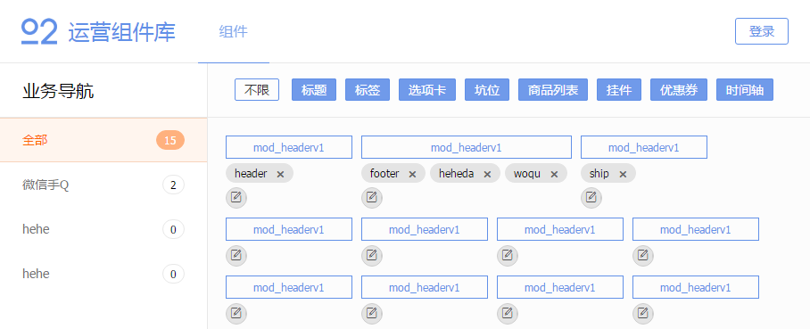

# Athena 组件平台

集合组件上传、组件拉取、和组件预览功能。

## 技术组成

- 前端 vue+webpack
- 后端 koa
- 数据存储 Leancloud

## 前端页面展示



## 部署指引

- 安装 NodeJS（建议版本>=6.0.0）
- 注册 Leancloud

``` bash
git clone https://github.com/o2team/athena-component.git

cd athena-component
npm install
npm install babel-cli -g
node install

cd app
npm install
```

- **前端配置**

	修改 `main.js` 里 `Leancloud` 的配置项， 

- **前端调试 ./app -> 运行后访问：http://localhost:8080**

	``` bash
	npm run dev
	```

- **前端编译 ./app**

	``` bash
	npm run build
	```

- **后端配置**

	ac-config.js，主要是端口与 `Leancloud` 配置项

- **hack修改** （现在用不上了，重命名的工作已经交给客户端）

	archiver 的 on('entry') 触发前时的状态已经是 `finalize:true`，即已经添加到压缩文件里了，但我们需要在文件添加到队列前重命名文件，因此在 `./node_modules/archiver/lib/core.js` 搜索 `Archiver.prototype._append = function(filepath, data)`，在它里面第一行添加 `this.onBeforeAppend && this.onBeforeAppend(filepath, data);`，如下：
	
	``` javascript
	Archiver.prototype._append = function(filepath, data) {
		this.onBeforeAppend && this.onBeforeAppend(filepath, data);
		/* ... */
	};
	```
	
	如此，就可以在自己代码中自定义：
	
	``` javascript
	archive.onBeforeAppend = function(filePath, data) {
		// Do something. 这里是重命名
		data.name = new Date().getTime().toString();
	}
	```
	
	后续：其实做到像 `on('beforeAppend', function() {})` 这样写，但还没摸透它，就酱

- **后端开发 ./ -> 运行后访问：http://localhost**

	``` bash
	npm run test
	```

- **前后端双服务联调指引**

	（待更新）

## API

总览：

- HTTP POST /api/push
- HTTP GET  /api/pull/:id/:rename?
- HTTP GET  /api/detail?id=xxx
- HTTP GET /api/detail-info?id=xxx
- HTTP GET /api/business/list
- HTTP GET /api/classify/list

``` javascript
/**
 * HTTP POST /api/push
 * @description 上传组件
 *
 * @param {String} <appId> 应用ID
 * @param {String} <moduleId> 模块ID
 * @param {String} <platform> 平台 pc | h5
 * @param {String} <widget> zip组件打包文件
 * @param {String} <author> 作者，白名单校验
 * @param {String} [description] 描述，默认从组件配置文件中读取
 * @param {String} [business] 所属业务ID
 * @param {String} [classify] 所属分类ID
 * 
 * @response 200 { no:0, data: { id: widgetId } }
 */
```

``` javascript
/**
 * HTTP GET /api/pull/:id/:rename?
 * @description 拉取组件。更直接地 —— /warehouse/id 可直接获取到组件
 * 
 * @param {String} <id> 组件ID
 * @param {String} [rename] 重命名名称
 */
```

``` javascript
/**
 * HTTP GET /api/detail?id=xxx
 * @description 组件详情，返回代码及组件信息
 * 
 * @param {String} <id> 组件ID
 *
 * @response { contHtml, contCss, contJs, widget }
 */
```

``` javascript
/**
 * HTTP GET /api/detail-info?id=xxx
 * @description 组件详情，返回组件信息，不包含代码
 * 
 * @param {String} <id> 组件ID
 *
 * @response widget
 */
```

``` javascript
/**
 * HTTP GET /api/business/list
 * @description 业务列表
 * 
 * @response businesses
 */
```

``` javascript
/**
 * HTTP GET /api/classify/list
 * @description 类别列表
 * 
 * @response classify
 */
```

**Leancloud已提供相关接口，以下API不在后台提供：**

- 组件列表查询
- 白名单列表查询
- 白名单 增/删
- 组件标签 增/删
- 用户登录/登出

为什么有些接口不直接用Leancloud提供的？保证Athena不用另外再配置Leancloud，也方便以后数据迁移。

## Leancloud 初始化指引

*为什么建议手动初始化？`Leancloud` 并不像 `Mongodb` 拥有“版本”的记录，数据在第一次插入时就固定了它的类型，类型是不能被更改的*

字段如无指定，默认类型为 `String`

- _Role，添加一角色 `admin`
- _User，添加一用户 `admin` 并关联至 _Role admin
	- username
	- password
- Business，创建（限制写入）
	- !name
- Classify，创建（限制写入），固定数据 = 标题+标签+选项卡+坑位+商品列表+挂件+优惠券+时间轴
	- !name
- Widget，创建（无限制）
	- !name
	- !author
	- !appId
	- !moduleId
	- !platform (default h5)
	- !pullTimes (Number default 0)
	- desc
	- tags (Array)
	- business (Pointer -> Business)
	- classify (Pointer -> Classify)
- Account，创建（限制写入），赋予 _Role admin: create, delete, update
	- !name

## 上传组件规范

（待确认）

- 全部或部分：
	- 1个 images 文件夹 + N个图片文件
	- 1个 HTML 文件
	- 1个 CSS / SCSS 文件，如同时存在，SCSS 优先，CSS 被忽略，目前只支持预处理器 `SCSS`
	- 1个 Javascript 文件
	- 1个 JSON 配置文件（必需）
- 不包含外层文件夹，无组件依赖
- 除图片文件，所有文件名跟组件名一致

## Athena 平台迭代

饿~饿~饿！

- 组件上传选择 `业务` 和 `分类`
- 组件上传分析SASS依赖，编译SASS
- 组件下载安置SASS依赖
- 组件重命名